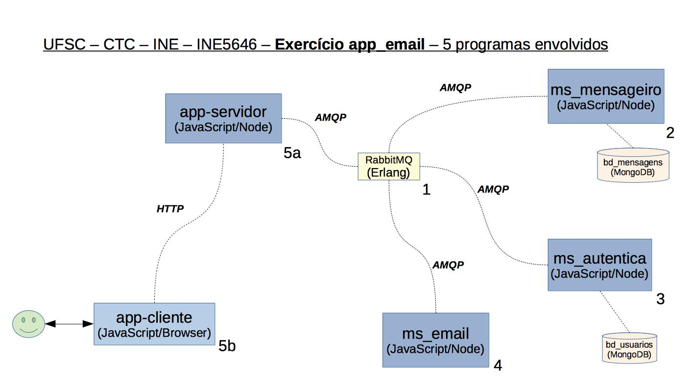

# UFSC - CTC - INE - INE5646 Programação para Web :: App email

## Aplicação para web

A aplicação tem por objetivo permitir que usuários cadastrados enviem mensagens para outros usuários cadastrados. Além disso o usuário cadastrado pode ver as mensagens que já enviou. O transporte dessas mensagens é feito por meio de e-mail.

Um usuário se cadastra fornecendo seu e-mail, seu  nome e uma senha para acesso à aplicação. A aplicação então envia um e-mail para o endereço fornecido contendo um link que, quando clicado, confirmará o cadastro.

O código da aplicação está organizado na forma de ***microserviços***. Há três microservicos:

* **ms_email**: responsável pelo envio e validação de e-mails.

* **ms_autentica**: responsável pelo cadastro e autenticação de usuários.

* **ms_mensageiro**: responsável pelo envio e leitura de mensagens.

A aplicação web, que contém a interface com o usuário, interage com os microserviços para poder atender as demandas feitas pelos usuários.

## Objetivo do Exercício

O objetivo da aplicação é demonstrar uma forma de implementação da arquitetura de microserviços. A imagem a seguir  mostra a arquitetura específica desta aplicação.

 

## Bug do Exercício

O micro serviço *ms_mensageiro* não implementou o algoritmo que retorna as mensagens que um usuário já enviou.
O algoritmo a ser implementado deve obedecer as seguintes considerações:

* se o token JWT enviado não puder ser renovado então a resposta deve indicar que o token expirou

* se o token JWT foi renovado então a resposta deve conter o novo token e as qtd últimas mensagens (emails) enviadas.

## Tecnologias Utilizadas

Os microserviços são implementados com o *framework* **[Moleculer](https://moleculer.services/)**. A aplicação web utiliza, no lado servidor, o *framework* **[Express](https://expressjs.com/)** e, no lado cliente, a biblioteca **[React](https://pt-br.reactjs.org/)**.

A comunicação entre a aplicação principal e os microserviços e entre os próprios microserviços utiliza o software **[RabbitMQ](https://www.rabbitmq.com/)**. Uma forma de ter acesso a este programa é via serviço oferecido pela empresa **[CloudAMQP](https://www.cloudamqp.com/)**.

O microserviço **ms_email** utiliza a biblioteca **[Nodemailer](https://nodemailer.com/about/)** para enviar e-mails utilizando uma conta de e-mail cadastrada no Google. Não utilize sua conta pessoal, crie uma conta específica para este exercício. Utiliza também o serviço **[IPQUALITYSCORE](https://www.ipqualityscore.com/documentation/email-validation/overview)** para validar o e-mail, ou seja, garantir que o endereço de e-mail realmente existe.

O microserviço **ms_autentica** utiliza um banco de dados **MongoDB** para armazenar os dados dos usuários cadastrados. Recomendo a criação da base de dados via **[MongoDB](https://www.mongodb.com/)**. Cada usuário é identificado por um **token JWT** gerado pela biblioteca **[jsonwebtoken](https://github.com/auth0/node-jsonwebtoken#readme)**.

O microserviço **ms_mensageiro** utiliza um banco de dados **MongoDB** para armazenar as mensagens enviadas pelos usuários. Como no *ms_autentica* recomendo a criação da base de dados via **MongoDB**.

## Organização do código fonte

O código fonte deste exercício está organizado da seguinte forma:

* **diretório app** : contém a aplicação para web que se utiliza dos microserviços.

* **diretório ms_email** : contém o microserviço *ms_email*.

* **diretório ms_autentica** : contém o microserviço *ms_autentica*.

* **diretório ms_mensageiro** : contém o microserviço *ms_mensageiro*.

* **diretório códigos** : contém **uma cópia** dos arquivos *.env*  utilizados pelos três microserviços e pela aplicação para web. Você deve naturalmente redefinir os valores de cada variável para os valores verdadeiros. Depois de definidos os valores, copie cada arquivo *.env*  para dentro do diretório raiz de cada microserviço e da aplicação para web.

## Colocando tudo no ar

Para colocar no ar a aplicação para web e os três microserviços abra um terminal no diretório raiz e digite:

```bash
docker-compose up
```
